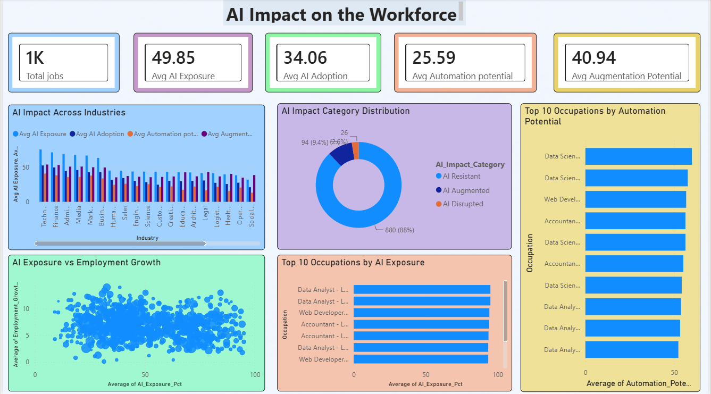
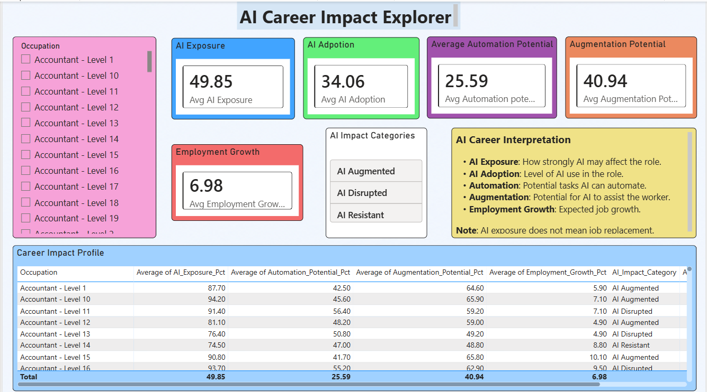

# 🤖 AI Impact on Jobs | Power BI

## 📌 Project Overview
Artificial Intelligence is changing how different occupations may be performed. This project examines whether AI is more likely to automate tasks, augment workers, or have a disruptive or resistant impact across occupations.

## 🎯 Project Objective
The objective was to analyze AI-related job indicators and convert them into an interactive Power BI dashboard that helps users compare occupations and understand potential workforce impact.

## 🛠️ Tools & Technologies
- **Power BI** – Dashboard development and data visualization
- **Microsoft Excel** – PivotTable analysis and dataset management
- **DAX** – Measures and interactive report logic

## 📊 Dataset & Metrics
The analysis covered 1,000 occupations.

| Metric | Value |
|---|---:|
| Total Occupations | 1,000 | 
| Average AI Exposure | 49.85 | 
| Average AI Adoption | 34.06 | 
| Average Automation Potential | 25.59 | 
| Average Augmentation Potential | 40.94 | 

## 🔍 Key Insights
- AI exposure and AI adoption are different measures; high exposure does not automatically mean high current adoption.
- Augmentation potential (40.94) is higher than automation potential (25.59) in this dataset.
- AI impact varies across occupations, so occupation-level analysis adds useful context.
- The AI Impact Category groups occupations as AI Augmented, AI Disrupted, or AI Resistant.

## 💡 Business Value
The dashboard converts occupation-level data into a visual decision-support tool for exploring workforce trends, comparing occupations, and understanding AI-related career impact.

## 📷 Dashboard Preview

### Workforce Overview

### Career Impact Explorer

## 📁 Project Files

| File | Description |
|---|---|
| [📊 Power BI Dashboard](./AI%20IMPACT%20ON%20JOBS.pbix) | Download and open the interactive Power BI dashboard |
| [📁 AI Jobs Dataset](./AI%20Impact%20on%20Jobs%20Dataset.xlsx) | Excel dataset used for the analysis |
| [📄 Case Study](./AI%20Impact%20on%20Jobs%20Case%20Study.pdf) | Detailed project objective, methodology, and insights |

---

## 👨‍💻 Author

**Devesh Singh**

Recent BBA Graduate | Business Analyst / Data Analyst

🔗 **Portfolio:** https://deveshwork.lovable.app/

🔗 **GitHub:** https://github.com/devesh-analytics
